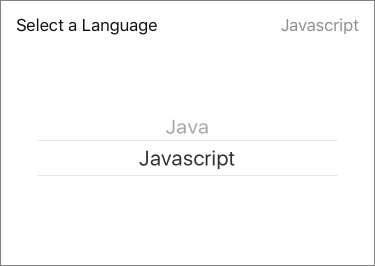

`InputPicker` (component)
=========================

InputPicker provides a unified API for Android and iOS
picker rows.

On iOS, when the user selects the picker row,
we want the row to expand to reveal the picker, which is the
child passed to this component. The value prop appears
on the top right of the picker row. It should be the humanized
version of the selected value in the picker.

On Android, we display the picker as the row itself. When
selected, the picker prompt will occur. A label is
rendered above the picker. The value prop is ignored,
since the Android picker already prints the value for us.

@composes InputTouchable, InputExpandable

Props
-----

### `backgroundColor`

type: `string`


### `children`

type: `node`


### `editable`

type: `bool`
defaultValue: `true`


### `expanded`

controls whether the picker is visible. (iOS only) *

type: `bool`


### `label` (required)

the label for the picker *

type: `string`


### `onToggleExpansion` (required)

a function called when toggling the visibility of the picker. (iOS only) *

type: `func`


### `panza` (required)

theme provided by higher order component *

type: `object`


### `value`

the picker value displayed in the row. (iOS only) *

type: `string`

## Examples

### InputPicker with Picker Child



```javascript
import { InputPicker } from 'panza'
import {
  Picker
} from 'react-native'

<InputPicker
  expanded={this.state.focusPicker}
  value={this.state.language}
  label='Select a Language'
  editable={this.state.editable}
  onToggleExpansion={() => {
    this.setState({ focusPicker: !this.state.focusPicker })
  }}>
  <Picker
    prompt='Select a language'
    style={{ width: 300 }}
    selectedValue={this.state.language}
    onValueChange={(lang) => this.setState({ language: lang })}>
      <Picker.Item label='Java' value='Java' />
      <Picker.Item label='Javascript' value='Javascript' />
  </Picker>
</InputPicker>
```
