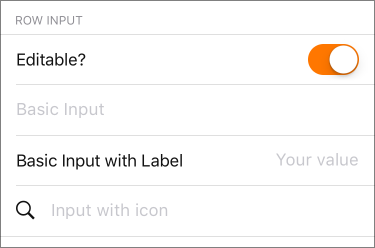

`InputRow` (component)
======================

A removable input

Props
-----

### `autoFocus`

type: `bool`
defaultValue: `false`


### `backgroundColor`

type: `string`
defaultValue: `'white'`


### `condensed`

type: `bool`


### `editable`

type: `bool`
defaultValue: `true`


### `height`

type: `number`
defaultValue: `50`


### `icon`

type: `node`


### `inverted`

type: `bool`


### `keyboardType`

defaultValue: `'numeric'`


### `label`

type: `string`


### `labelWidth`

type: `number`


### `onChangeText` (required)

type: `func`


### `onRequestRemove`

type: `func`
defaultValue: `function noop() {}`


### `onSelectLabel`

type: `func`


### `placeholder`

type: `string`


### `removable`

type: `bool`
defaultValue: `false`


### `textAlign`

defaultValue: `'right'`


### `value`

type: `string`


### `vertical`

type: `bool`
defaultValue: `false`


### `verticalHeight`

type: `number`
defaultValue: `80`

## Examples

### Basic input with placeholder


```javascript
import { InputRow } from 'panza'

<InputRow
  placeholder='Basic Input'
  value={value}
  editable
  onChangeText={(text) => {
    props.onChangeText(text)
  }}
/>
```

### Basic input with label and placeholder


```javascript
import { InputRow } from 'panza'

<InputRow
  label='Basic Input with Label'
  placeholder='Your value'
  value={value}
  onChangeText={onChangeText}
/>
```

### Basic input with an icon


```javascript
import { InputRow, SearchIcon } from 'panza'

<InputRow
  icon={<SearchIcon />}
  textAlign='left'
  editable={this.state.editable}
  placeholder='Input with icon'
/>
```

### Within an InputGroup

```javascript
import {
  InputGroup,
  InputToggle,
  InputRow,
  SearchIcon
} from 'panza'

<InputGroup label='ROW INPUT' inset={16} mt={3}>
  <InputToggle
    value={this.state.editable}
    onTintColor='warning'
    onValueChange={(editable) => this.setState({ editable })}
    label='Editable?'
  />
  <InputRow
    placeholder='Basic Input'
    value={this.state.basic}
    editable={this.state.editable}
    onChangeText={(basic) => this.setState({ basic })} />
  <InputRow
    label='Basic Input with Label'
    placeholder='Your value'
    value={this.state.label}
    editable={this.state.editable}
    onChangeText={(label) => this.setState({ label })} />
  <InputRow
    icon={<SearchIcon />}
    textAlign='left'
    editable={this.state.editable}
    placeholder='Input with icon' />
</InputGroup>
```
