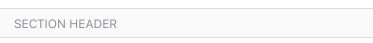

`SectionHeader` (component)
===========================

SectionHeader is used for rendering a section header within a ListView.
Supply text as the child.
@composes Base

Props
-----

### `backgroundColor`

type: `string`
defaultValue: `'gray'`


### `children`

type: `node`



```javascript
import { SectionHeader } from 'panza'

<SectionHeader>My Header Text</SectionHeader>
```
