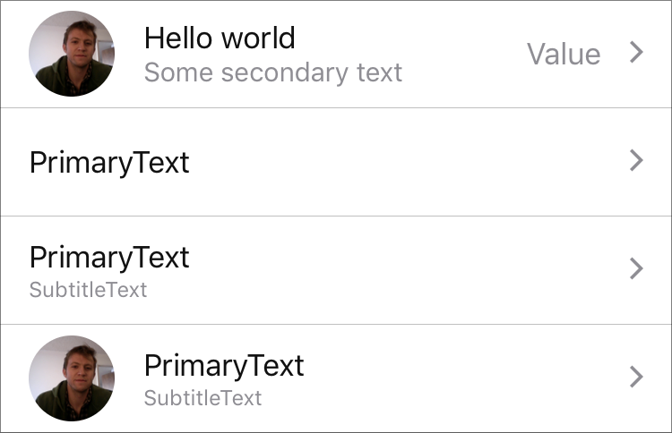

`TouchableRow` (component)
==========================

The basic RowCell for use within ListView. It displays
an image, primary text, secondary text, a value,
and an arrow right icon if the respective props are
specified.

@composes TouchableRowCell, Image, Text

Props
-----

### `height`

type: `number`


### `image`

type: `union(object|node)`


### `onPress` (required)

type: `func`


### `primaryText`

type: `string`


### `secondaryText`

type: `string`


### `showMore`

Displays a > arrow *

type: `bool`


### `value`

type: `string`

## Examples



```javascript
<TouchableRow
  onPress={noop}
  image={{uri: 'https://pbs.twimg.com/profile_images/2966797788/e3f7b52206be4d11c86a32a67dfe2fab_400x400.png'}}
  primaryText='Hello world'
  secondaryText='Some secondary text'
  value='Value'
/>
```

```javascript
<TouchableRow
  onPress={noop}
  primaryText='PrimaryText'
/>
```

```javascript
<TouchableRow
  onPress={noop}
  primaryText='PrimaryText'
  secondaryText='SubtitleText'
/>
```

```javascript
<TouchableRow
  onPress={noop}
  image={{uri: 'https://pbs.twimg.com/profile_images/2966797788/e3f7b52206be4d11c86a32a67dfe2fab_400x400.png'}}
  primaryText='PrimaryText'
  secondaryText='SubtitleText'
/>
```
