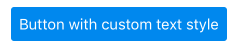
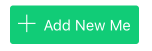

```javascript
import { Button } from 'panza'

<Button
  onPress={() => console.log('hello world')}
  label='Default Button'
/>
```


```javascript
import { Button } from 'panza'

<Button
  block
  onPress={() => console.log('hello world')}
  label='Button with block'
/>
```


```javascript
import { Button, SecondaryText } from 'panza'

<Button
  onPress={() => console.log('hello world')}
  p={1}>
    <SecondaryText color='white'>
      Button with custom text style & padding
    </SecondaryText>
</Button>
```


```javascript
import { SuccessButton, PlusIcon, SecondaryText } from 'panza'

<SuccessButton
  p={0}
  px={1}
  onPress={() => console.log('onPress')}>
    <PlusIcon color='white' mr={1}/>
    <SecondaryText color='white'>Add Another</SecondaryText>
</SuccessButton>
```
