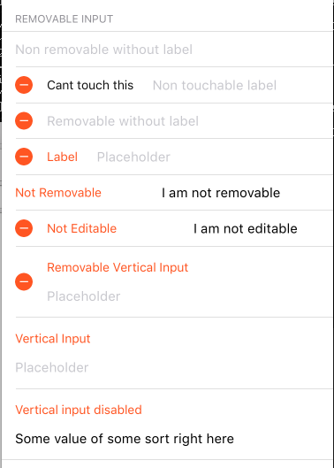

```javascript
<InputGroup
  label='REMOVABLE INPUT'
  inset={16} mt={3} mb={3}>
  <RemovableInput
    placeholder='Non removable without label'
    removable={false}
    editable={this.state.editable}
    onRemove={noop}
    onSelectLabel={noop}
    onChangeText={(removeInput) => this.setState({ removeInput })}
    value={this.state.removeInput}
  />
  <RemovableInput
    placeholder='Non touchable label'
    removable={true}
    onRemove={noop}
    editable={this.state.editable}
    label='Cant touch this'
    onChangeText={(removeInput) => this.setState({ removeInput })}
    value={this.state.removeInput}
  />
  <RemovableInput
    placeholder='Removable without label'
    removable={true}
    onRemove={noop}
    editable={this.state.editable}
    onSelectLabel={noop}
    onChangeText={(removeInput) => this.setState({ removeInput })}
    value={this.state.removeInput}
  />
  <RemovableInput
    label='Label'
    placeholder='Placeholder'
    onRemove={noop}
    editable={this.state.editable}
    onSelectLabel={noop}
    onChangeText={(removeInput) => this.setState({ removeInput })}
    value={this.state.removeInput}
  />

  <RemovableInput
    label='Not Removable'
    removable={false}
    labelWidth={150}
    editable={this.state.editable}
    placeholder='Placeholder'
    onRemove={noop}
    onSelectLabel={noop}
    onChangeText={(removeInput) => this.setState({ removeInput })}
    value={'I am not removable'}
  />

  <RemovableInput
    label='Not Editable'
    labelWidth={150}
    editable={this.state.editable}
    placeholder='Placeholder'
    onRemove={noop}
    onSelectLabel={() => {
      console.log('la la laaa la')
    }}
    onChangeText={(removeInput) => this.setState({ removeInput })}
    value={'I am not editable'}
  />

  <RemovableInput
    label='Removable Vertical Input'
    removable={true}
    vertical
    placeholder='Placeholder'
    onRemove={noop}
    editable={this.state.editable}
    onSelectLabel={noop}
    onChangeText={(removeInput) => this.setState({ removeInput })}
    value={''}
  />
  <RemovableInput
    label='Vertical Input'
    removable={false}
    vertical
    editable={this.state.editable}
    placeholder='Placeholder'
    onRemove={noop}
    onSelectLabel={noop}
    onChangeText={(removeInput) => this.setState({ removeInput })}
    value={''}
  />
  <RemovableInput
    label='Vertical input disabled'
    removable={false}
    editable={this.state.editable}
    vertical
    placeholder='Placeholder'
    onRemove={noop}
    onSelectLabel={noop}
    onChangeText={(removeInput) => this.setState({ removeInput })}
    value={'Some value of some sort right here'}
  />


</InputGroup>
```
