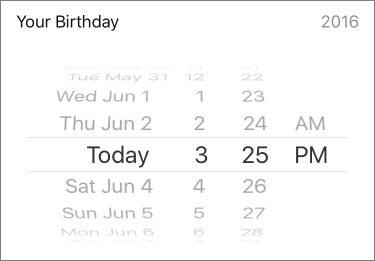

`InputDatePicker` (component)
=============================

Provides a cross-platform InputRow that prompts the user with
a native date-picker. On iOS devices, it expands the input to reveal
the date-picker. On Android, it prompts the user for a
date-picker in a popup.

Props
-----

### `date` (required)

type: `object`


### `editable`

type: `bool`
defaultValue: `true`


### `expanded` (required)

type: `bool`


### `label`

type: `string`


### `maxDate`

type: `string`


### `minDate`

type: `string`


### `mode`

type: `string`


### `onDateChange` (required)

type: `func`


### `onToggleExpansion` (required)

function called to toggle the visibility of the date-picker. (iOS only) *

type: `func`


### `value`

the currently selected date to be displayed in collapsed row. *

type: `string`



```javascript
import { InputDatePicker } from 'panza'

<InputDatePicker
  expanded={this.state.focusDate}
  date={this.state.date}
  editable={this.state.editable}
  value={new Date(this.state.date).getFullYear().toString()}
  onDateChange={(date) => this.setState({ date })}
  label='Your Birthday'
  onToggleExpansion={() => {
    LayoutAnimation.spring()
    this.setState({ focusDate: !this.state.focusDate })
  }}
/>

```
