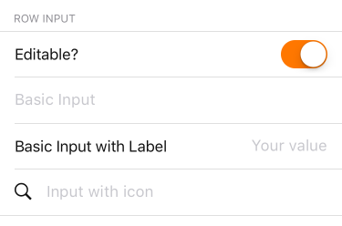

`InputGroup` (component)
========================

Wrapping components with InputGroup gives you the
option of giving Inputs dividing borders, dividing
borders with an inset, a top border (with a unique inset value),
a bottom border (with a unique inset value), shared background
colours, margins, and a label. You could supply your own
child components, too.

Props
-----

### `backgroundColor`

type: `string`


### `bottomInset`

left margin inset of the bottom border *

type: `number`
defaultValue: `0`


### `children`

type: `node`


### `inset`

left margin inset for the divider border *

type: `number`
defaultValue: `0`


### `label`

an optional label for the input group *

type: `string`


### `showBorder`

whether to show the dividing border *

type: `bool`
defaultValue: `true`


### `showBottomBorder`

whether to show the bottom border *

type: `bool`
defaultValue: `true`


### `showTopBorder`

whether show the top border *

type: `bool`
defaultValue: `true`


### `style`

type: `object`


### `topInset`

left margin inset of the top border *

type: `number`
defaultValue: `0`

## Examples


### An InputGroup with Input children



```javascript
import {
  InputGroup,
  InputToggle,
  InputRow,
  SearchIcon
} from 'panza'

<InputGroup label='ROW INPUT' inset={16} mt={3}>
  <InputToggle
    value={this.state.editable}
    onTintColor='warning'
    onValueChange={(editable) => this.setState({ editable })}
    label='Editable?'
  />
  <InputRow
    placeholder='Basic Input'
    value={this.state.basic}
    editable={this.state.editable}
    onChangeText={(basic) => this.setState({ basic })} />
  <InputRow
    label='Basic Input with Label'
    placeholder='Your value'
    value={this.state.label}
    editable={this.state.editable}
    onChangeText={(label) => this.setState({ label })} />
  <InputRow
    icon={<SearchIcon />}
    textAlign='left'
    editable={this.state.editable}
    placeholder='Input with icon' />
</InputGroup>
```
