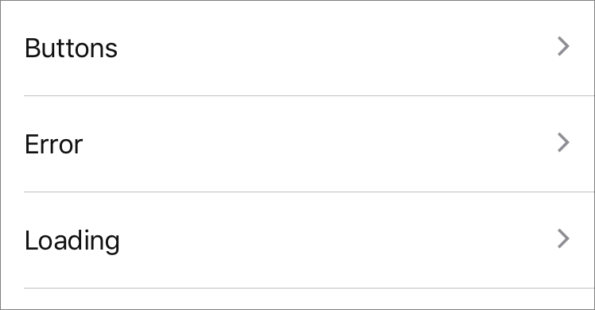

`RowSeparator` (component)
==========================

A simple component used to separate rows, with an
optional inset margin on the left or right.

Props
-----

### `inset`

type: `number`
defaultValue: `0`


### `insetRight`

type: `number`
defaultValue: `0`

## Examples

### RowSeparator with inset



```javascript

<ListView
  dataSource={dataSource}
  style={styles.list}
  renderSeparator={(a, b) => ((Platform.OS === 'ios') && <RowSeparator inset={16} key={a + b} />)}
  renderRow={(rowData) => (
    <TouchableRow
      onPress={() => onSelect(rowData)}
      primaryText={rowData.name}
      key={rowData.name} />
  )}
/>

```
