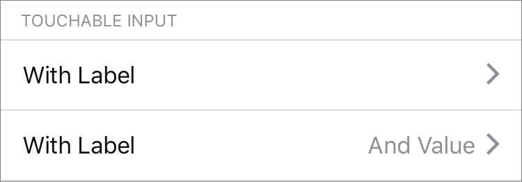

`TouchableInput` (component)
============================

An input row that is typically used when you want to allow
the user to select a value from another ListView. In essence,
this is very similar to a standard TouchableRow. In the future,
we may consider combining the two.

Props
-----

### `backgroundColor`

type: `string`
defaultValue: `'white'`


### `icon`

type: `node`


### `label` (required)

type: `string`


### `labelColor`

type: `string`
defaultValue: `'default'`


### `showMore`

type: `bool`
defaultValue: `false`


### `value`

type: `string`

## Examples

### Basic TouchableInputs



```javascript
<InputGroup mb={0} mt={3} label='TOUCHABLE INPUT'>
  <TouchableInput
    editable={this.state.editable}
    onPress={() => {
      console.log('baby baby baby, noo!')
    }}
    showMore
    label='With Label'
  />
  <TouchableInput
    editable={this.state.editable}
    onPress={() => {
      console.log('baby baby baby, noo!')
    }}
    showMore
    value='And Value'
    label='With Label'
  />
</InputGroup>
```
