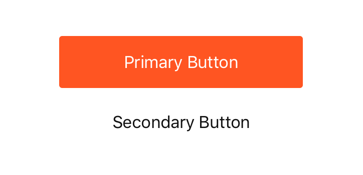

`VerticalButtonGroup` (component)
=================================

A vertical button group where the first option is the primary
option to select, while the second option is deemphasized. Typically
the first button would be a confirmation button, while the second
may be dismissal.

Props
-----

### `options` (required)

Button options *

type: `arrayOf[object Object]`

## Examples

### Basic VerticalButtonGroup



```javascript

<VerticalButtonGroup
  mt={2}
  px={2}
  options={[
    {
      label: 'Primary Button',
      onSelect: noop
    },
    {
      label: 'Secondary Button',
      onSelect: noop
    }
  ]}
/>

```
